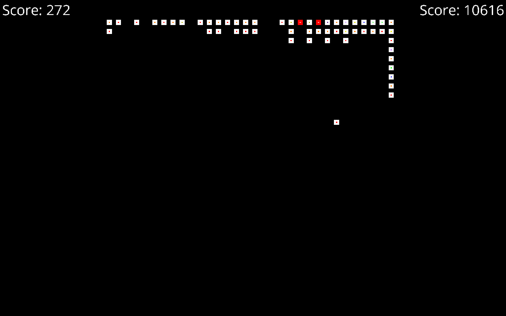

# 2^n

A 2048 Clone written in C++, with capabilities to create much, much bigger game boards.

## Deps
SDL

SDL_tff

args

## Make
Build it! - make all
Build with debugging - make debug
Clean up - make clean

## Images

8x8 grid

16x16 grid

32x32 grid

